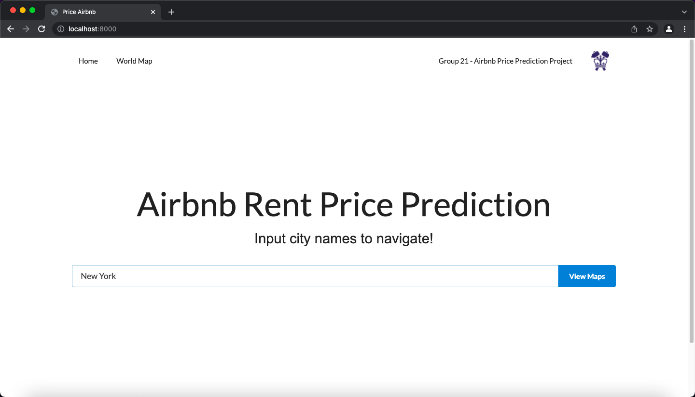
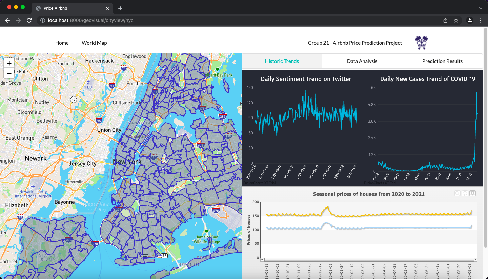
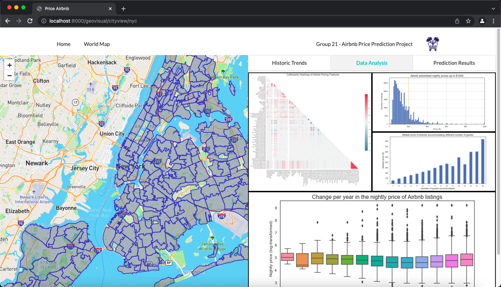
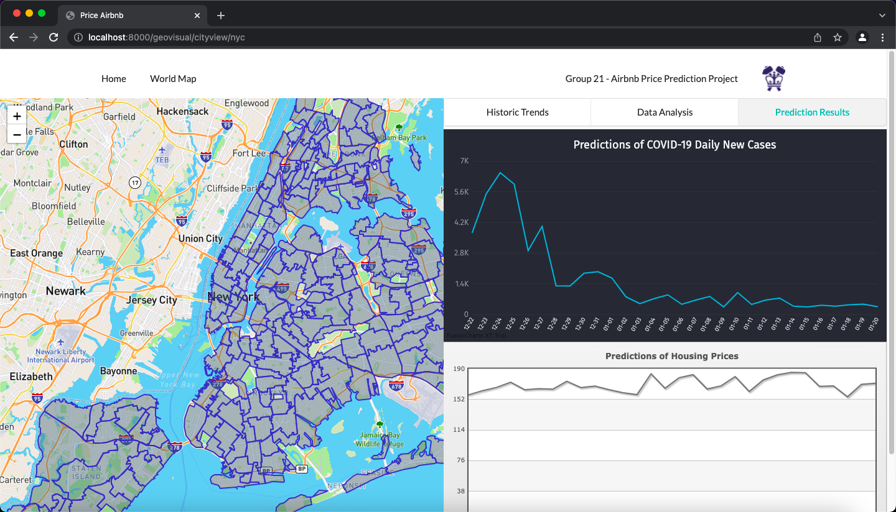
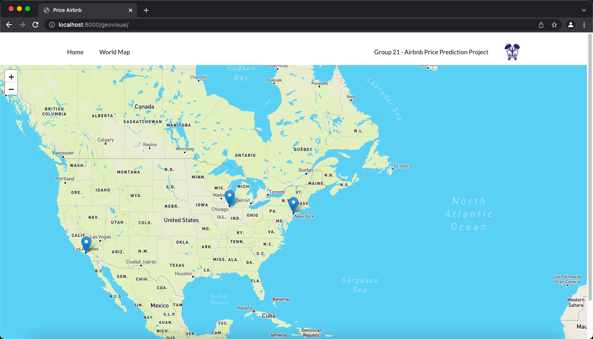

# Airbnb Rent Price Prediction Under COVID-19 Pandemic

Predict the Airbnb housing price. Will consider housing price history, local covid cases and search engine emotions.

## Environment setup 

```
pip install -r requirements.txt
```

## start the application 

```
python manage.py runserver 0.0.0.0:8000
```

Then open the link [localhost:8000](http://localhost:8000/). You'll get to the home page like this:


## Explore by Searching City

Enter a city name in the search bar.



Click "View Maps" button to get housing price trends, COVID trends and their predictions, along with sentiment analysis results.



There are also other tabs for you to explore!






## Explore by World Map

From Home page, click "WorldMap" at the top left corner. Then you get a view like,



Click the city arrow on the map. This is the same as you search the city name in seach bar.
